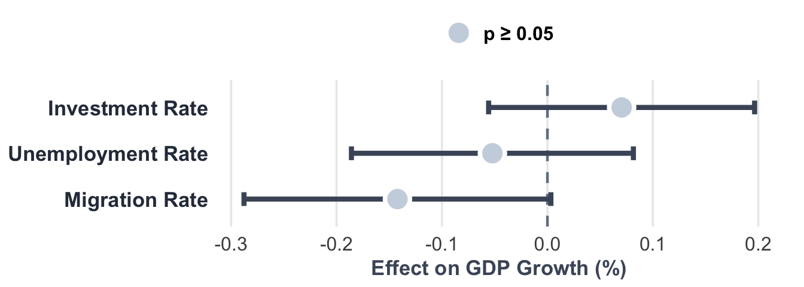

```{r setup, include=FALSE}
library(knitr)
knitr::opts_chunk$set(echo = FALSE, warning = FALSE, message = FALSE)
```

<style type="text/css">
/* ==========================================================================
   RESET RMARKDOWN DEFAULTS
   ========================================================================== */
body, .main-container {
    max-width: 100% !important;
    width: 100% !important;
    margin: 0 !important;
    padding: 0 !important;
}

/* !!! CRITICAL FIX !!! 
   Override Pandoc's default 'div.column' which sets width to 50% 
*/
div.column {
    display: flex !important;
    flex-direction: column !important;
    width: 100% !important; /* Forces it to fill the grid cell, not 50% */
    max-width: none !important;
    gap: 15px;
}

/* ==========================================================================
   POSTER STYLES
   ========================================================================== */
:root {
    --primary-green: #B5CE45;
    --text-dark: #222222;
    --bg-grey: #e0e0e0;
}

body {
    font-family: "Georgia", "Times New Roman", serif;
    background-color: var(--bg-grey);
    color: var(--text-dark);
}

/* Poster Container */
.poster {
    width: 100%;
    max-width: 1400px; /* Kept compact for the 'A4 Landscape' look */
    margin: 0 auto;
    background: white;
    box-shadow: 0 4px 15px rgba(0,0,0,0.2);
    display: flex;
    flex-direction: column;
}

/* HEADER SECTION */
header {
    background-color: var(--primary-green);
    color: white;
    padding: 15px 30px;
    display: flex;
    justify-content: space-between;
    align-items: center;
    -webkit-print-color-adjust: exact;
    print-color-adjust: exact;
    height: 130px; 
}

.header-content {
    text-align: center;
    flex-grow: 1;
    padding: 0 15px;
}

h1 {
    font-size: 2.2rem;
    margin: 0 0 8px 0;
    font-weight: normal;
    text-transform: uppercase;
    color: white;
    line-height: 1.1;
}

.authors {
    font-size: 0.9rem;
    margin-bottom: 5px;
    font-weight: bold;
    color: white;
}

/* Logo Box */
.logo-box {
    background: white;
    padding: 5px;
    height: 90px;
    width: 130px;
    display: flex;
    align-items: center;
    justify-content: center;
}

.logo-box img {
    max-width: 100%;
    max-height: 100%;
    object-fit: contain;
    margin: 0 !important;
}

/* MAIN GRID */
.content-grid {
    display: grid;
    grid-template-columns: repeat(3, 1fr);
    gap: 15px; /* Clean gap */
    padding: 20px;
}

/* HEADERS */
h2 {
    background-color: var(--primary-green);
    color: white;
    font-size: 1.4rem;
    text-align: center;
    padding: 6px 0;
    margin: 0 0 12px 0;
    font-weight: normal;
    -webkit-print-color-adjust: exact;
    print-color-adjust: exact;
}

/* TEXT & TABLES */
p, li {
    line-height: 1.35;
    margin-bottom: 8px;
    text-align: justify;
    font-size: 0.95rem;
}

table {
    width: 100%;
    border-collapse: collapse;
    margin: 8px 0;
    font-family: sans-serif;
    font-size: 0.85rem;
    border: 1px solid #ddd;
}

th {
    border-bottom: 2px solid #000;
    text-align: left;
    padding: 4px;
    font-weight: bold;
}

td {
    border-bottom: 1px solid #ccc;
    padding: 4px;
}

/* SPECIAL ELEMENTS */
.stats-box {
    display: flex;
    justify-content: space-around;
    background: #f9f9f9;
    padding: 8px;
    border: 1px solid #eee;
    margin-bottom: 12px;
    text-align: center;
    font-family: sans-serif;
    -webkit-print-color-adjust: exact;
    print-color-adjust: exact;
}

.stat-item strong {
    font-size: 1.3rem;
    display: block;
    color: #333;
}

.chart-placeholder {
    width: 100%;
    display: flex;
    justify-content: center;
    margin-bottom: 10px;
}

.chart-placeholder img {
    max-width: 100%;
    height: auto;
    border: 1px solid #ddd;
    margin: 0 !important;
}

/* PRINT MEDIA QUERY */
@media print {
    @page {
        size: landscape;
        margin: 0;
    }
    body {
        background-color: white;
        margin: 0;
        -webkit-print-color-adjust: exact !important;
        print-color-adjust: exact !important;
    }
    .poster {
        box-shadow: none;
        max-width: 100%;
        width: 100%;
        margin: 0;
    }
    .content-grid {
        gap: 15px;
    }
}
</style>

<div class="poster">
<header>
<div class="logo-box">

</div>
<div class="header-content">
<h1>Determinants of GDP per Capita Growth in the EU</h1>
<div class="authors">Mehmet Karaca 20250344, Alexander XY, Muhammad Ammar 20250440, Khuzaima Bashir 20250441</div>
<div style="font-size: 0.9rem; font-style: italic; margin-top: 5px;">NOVA Information Management School (NOVA IMS), Lisbon</div>
</div>
<div class="logo-box">

</div>
</header>
<div class="content-grid">
<div class="column">
<section>
<h2>Introduction</h2>
<div class="stats-box">
<div class="stat-item"><strong>27</strong>EU Countries</div>
<div class="stat-item"><strong>10</strong>Years</div>
<div class="stat-item"><strong>~270</strong>Observations</div>
</div>
<p><strong>Context:</strong> Migration crisis (2015), COVID-19 (2020), recovery (2021–22).</p>
<p><strong>Goal:</strong> Identify key drivers of economic growth across EU.</p>
<p>We wanted to check what are the factors influencing GDP growth using panel econometrics with country fixed effects.</p>
</section>
<section>
<h2>Research Question</h2>
<p style="font-weight: bold; text-align: center; font-size: 1.1rem; padding: 10px;">
“How do migration, unemployment, and investment affect GDP per capita growth in the EU?”
</p>
</section>
<section>
<h2>Hypotheses</h2>
<ul>
<li><strong>H1:</strong> Migration ↑ → GDP Growth ↑ <em>(Labor supply)</em></li>
<li><strong>H2:</strong> Unemployment ↑ → GDP Growth ↓ <em>(Demand loss)</em></li>
<li><strong>H3:</strong> Investment ↑ → GDP Growth ↑ <em>(Capital accumulation)</em></li>
</ul>
</section>
<section>
<h2>Data</h2>
<p><strong>Source:</strong> Eurostat (2014–2023)</p>
<table>
<thead>
<tr><th>Variable</th><th>Description</th><th>Unit</th></tr>
</thead>
<tbody>
<tr><td>GDP Growth</td><td>Real GDP per capita</td><td>%</td></tr>
<tr><td>Migration</td><td>Net migration rate</td><td>‰</td></tr>
<tr><td>Unemployment</td><td>Rate (15–74 years)</td><td>%</td></tr>
<tr><td>Investment</td><td>Gross fixed capital</td><td>% GDP</td></tr>
</tbody>
</table>
</section>
</div>
<div class="column">
<section>
<h2>Methodology</h2>
<p>To answer our research question, we extracted panel data and tested three models:</p>
<table>
<tr><td><strong>Pooled OLS</strong></td><td>Baseline</td></tr>
<tr><td><strong>Fixed Effects</strong></td><td>Controls unobserved heterogeneity</td></tr>
<tr><td><strong>Random Effects</strong></td><td>Efficiency under exogeneity</td></tr>
</table>
<p><strong>Model Selection:</strong> Hausman Test → <strong>FE preferred</strong>. F-Test → Individual effects significant.</p>
</section>
<section>
<h2>Diagnostics</h2>
<table>
<thead>
<tr><th>Test</th><th>Result</th><th>Action</th></tr>
</thead>
<tbody>
<tr><td>Hausman</td><td>p < 0.05</td><td>→ Use FE</td></tr>
<tr><td>F-Test</td><td>p < 0.001</td><td>→ Effects present</td></tr>
<tr><td>BP (Hetero.)</td><td>p < 0.05</td><td>→ Robust SE</td></tr>
</tbody>
</table>
<p style="text-align: center; font-weight: bold; margin-top: 10px;">
Final Model: Fixed Effects with cluster-robust Standard Errors.
</p>
</section>
</div>
<div class="column">
<section>
<h2>Results</h2>
<div class="chart-placeholder">

</div>
<table>
<thead>
<tr><th>Variable</th><th>Coef</th><th>SE</th><th>Sig</th></tr>
</thead>
<tbody>
<tr><td>Migration</td><td>-0.142</td><td>0.074</td><td>.</td></tr>
<tr><td>Unemployment</td><td>-0.052</td><td>0.068</td><td></td></tr>
<tr><td>Investment</td><td>0.070</td><td>0.064</td><td>*</td></tr>
</tbody>
</table>
<div style="font-size: 0.8rem; text-align: center;">* p<.05, ** p<.01, *** p<.001</div>
</section>
<section>
<h2>Conclusion</h2>
<p>The significance of investment and unemployment in predicting GDP growth proved to be consistent with economic theory.</p>
<ul>
<li>📉 <strong>Unemployment:</strong> Negative effect on GDP growth.</li>
<li>📈 <strong>Investment:</strong> Positive effect on GDP growth.</li>
<li>🌍 <strong>Migration:</strong> Mixed results depending on specification.</li>
</ul>
</section>
<section>
<h2>Next Steps</h2>
<p><strong>Policy Implications:</strong></p>
<ol style="margin-left: 20px;">
<li><strong>Reduce unemployment</strong> → strongest growth lever.</li>
<li><strong>Stimulate investment</strong> → capital formation matters.</li>
<li><strong>Migration policy</strong> → context-specific analysis needed.</li>
</ol>
<p style="font-size: 0.8rem; margin-top: 15px; border-top: 1px solid #ccc; padding-top: 5px;">
<strong>References:</strong> Eurostat (2024); Boubtane et al. (2016); Ortega & Peri (2013); Wooldridge (2010).
</p>
</section>
</div>
</div>
</div>